# kubernetes_DevOps
(Groupe : Yann NGUYEN, Axelle REFEYTON, Jean ROELENS)

Le but de ce projet étais de nous familiariser avec kubernetes et de toucher du doigt ce dont-il s'agissait.
Nous verrons au cours de ce document comment nous avons installé les dépendences nécessaires et essayer de déployer nos containers
dans notre kube.

Nous disposions déjà au préalable d'une machine virtuel ubuntu sur laquelle docker était installé. Nous avons donc commencé avec l'installation des autres dépendences que sont minikube et kubectl

## Setup / Installation

Pour commencer nous avons installer les dépendences que sont : **curl, wget, apt-transport-https, gnupg2**

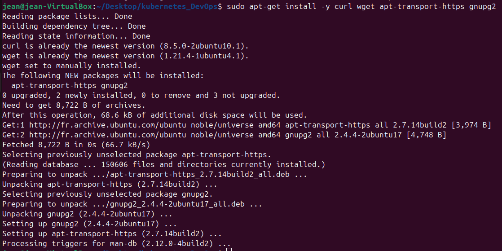
```
N'oubliez pas de faire un apt-get update et apt-get upgrade afin de garder votre système à jour
```

Puis finalement on installe minikube et kubectl

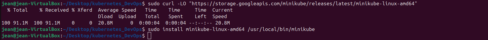

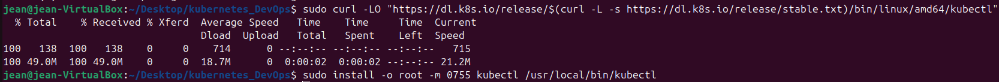

Une fois les installations terminé on va rentrer dans le vif du sujet

## Votre premier kube

Pour pouvoir start votre premier kube via minikube il va falloir choisir un driver, nous avons utilisé celui qui est conseillé en général c'est à dire Docker, donc pour cela il faut que le service docker soit lui-même start.

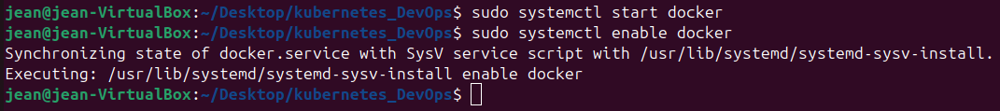

Bien maintenant au tour de minikube.

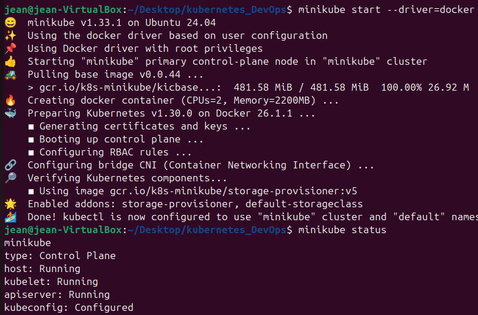

Félicitations vous avez démarré votre premier kube 👏🍾
Mais bon que serait un kube sans quelque services...

## Ajouter des services à votre kube

La maniére dont kubernetes, et donc minikube, rajoute des services va être par le biais de fichier yaml nous allons donc créer trois fichier yaml pour chaque service dont nous avons besoins.

**Apache**

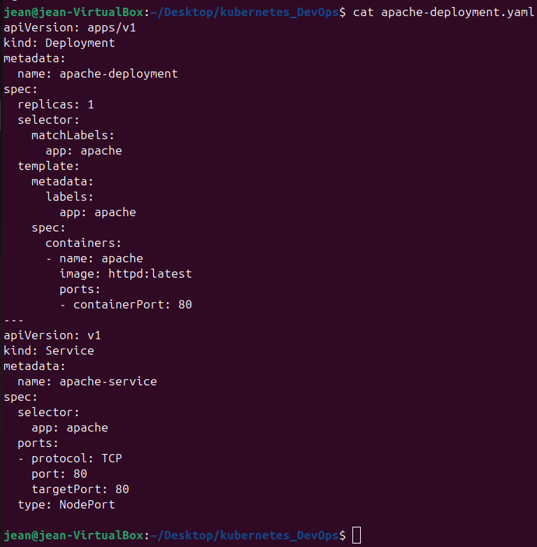


**MySQL**

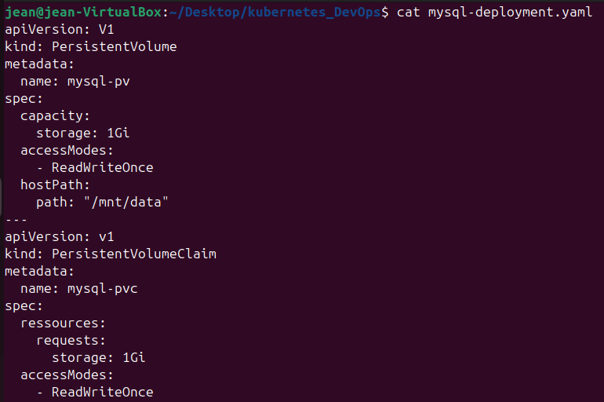
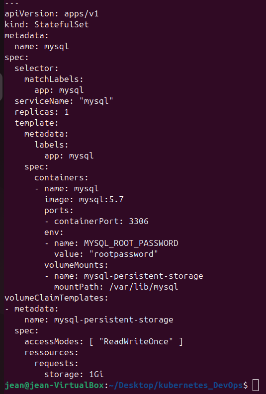

**Php**

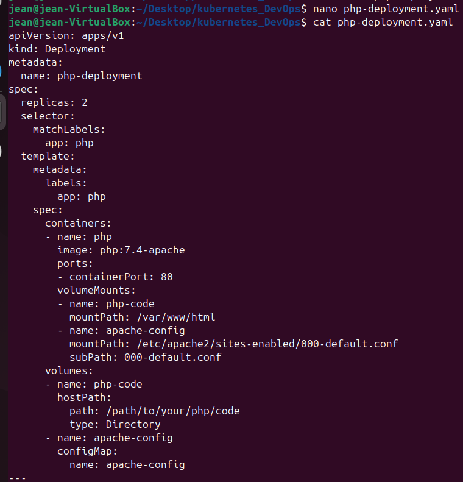
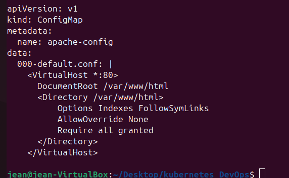

Une fois que ceux-ci sont crées nous allons utiliser la commande kubectl pour pouvoir deployer les différent fichier yaml.

```
kubectl apply -f <NOM_FICHIER_YAML>
```
une fois appliqué on vérifie que les dockers se sont bien lancé avec la commande 
```
kubectl get pods
```

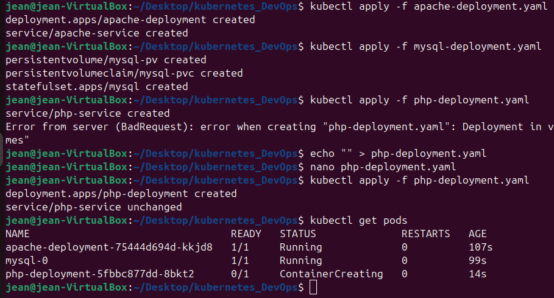

## Direction l'application

avant de nous rendre sur notre application nous allons devoir configure un dernier fichier yaml (eh oui nous avons menti il y en a plus de trois) qui est le fichier ingress.yaml, il faut voir l'ingres comme une maniére de passer des routes à notre kube.

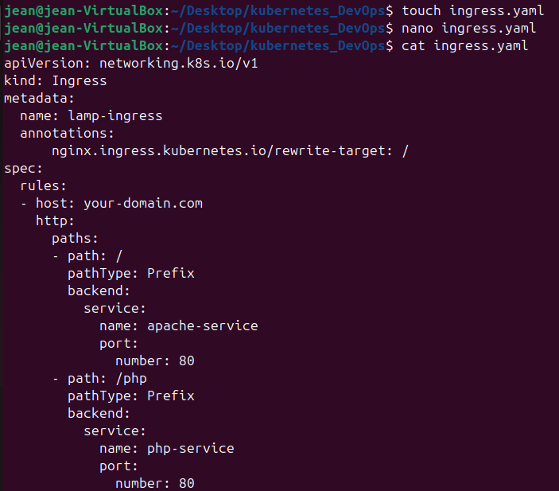

Une fois fait il faut le déployer.

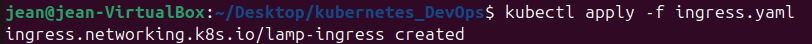

Et finalement l'enable : 

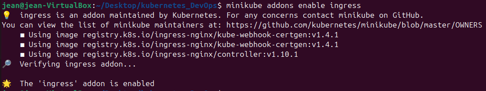

Minikube dispose d'un moyen d'obtenir l'url directement de votre application autant ne pas se fatiguer et l'utiliser à notre avantage.

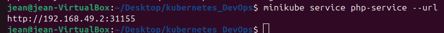

Et finalement si on se rend sur l'url :

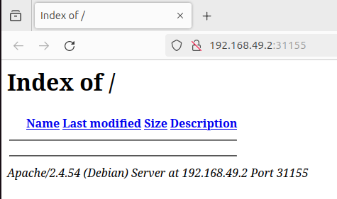

Nous avons réussi à atteindre notre page php.

### Autres mentions :

**Peupler la table mysql**

Comme vous avez pu le constater on a un service mysql mais celui-ci n'est jamais peupler si vous souhaitez le peupler voici la marche à suivre, tout d'abord ouvrez un bash dans le conteneur mysql : 

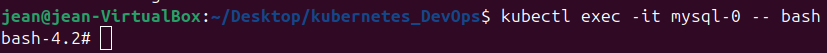

Et finalement ensuite peuplez votre base mysql comme vous le feriez de maniére classique :

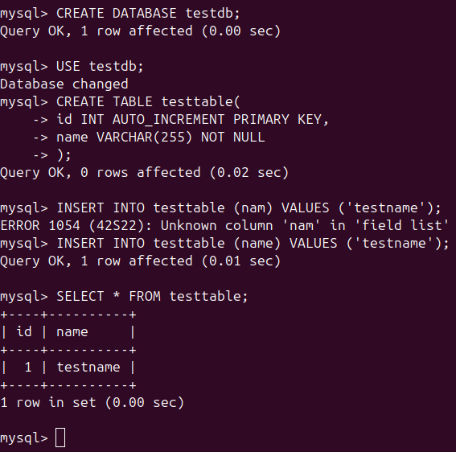

**Docker sans sudo**

Tout le monde aime la commande *sudo* mais avec docker cela peu vite devenir redondant voici comment faire en sorte de pouvoir lancer docker sans sudo : 

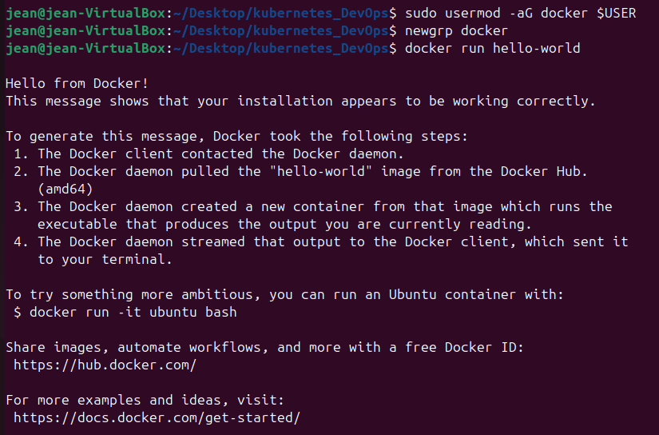

**Utiliser le fichier hosts pour les ips**

Il n'est pas rare de voir les gens dans les tutoriels ne pas utiliser 127.0.0.1 pour atteindre leur port local mais tout simplement "LocalHost", vous êtes vous déjà demander comment faire ? Il s'agit d'un fichier qui se trouve sous le chemin **/etc/hosts** dans le quel vous pouvez paramétrez le DNS comme suivant : 

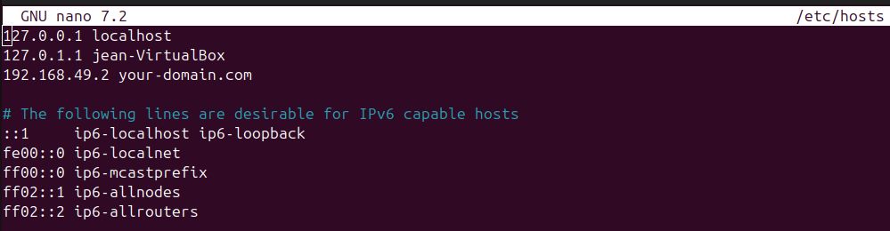

**php et mysql ne communique pas**

Ceci est le point bloquant que nous n'avons pas réussi à résoudre, notre problème actuel (même après avoir essayé de recommencer à 0 différement plusieurs fois) est que lors de l'installation de l'image php:7.2-apache l'instance php ne dispose pas de librairie comme POD ou mysqli qui nous empéche de dialoguer avec l'instance mysql et donc de créer une véritable application.


